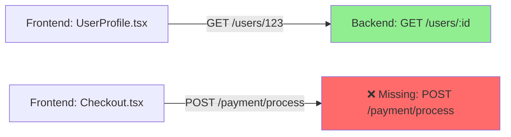

# SPRINT 10: IMPLEMENTATION CONTRACT

**Date**: January 21, 2026  
**Status**: READY FOR ENGINEERING  
**Scope Control**: HARD (No scope creep)  
**Goal**: Make Sprint 9 tests executable and passable

---

## EXECUTIVE SUMMARY

### The Actual Gap

✅ Sprint 9 tests exist and compile  
✅ RunValidatorNew.ts and FixtureSuite.ts exist  
❌ **Missing**: The `.reposense/runs/<runId>/` artifact backbone that tests validate

### Sprint 10 Mission (NOT What Was Previously Stated)

**NOT**: Build Express backend  
**NOT**: Build multi-language scanners  
**NOT**: Build CI/CD integration  

**YES**: Implement Run Artifact Backbone
- Create `.reposense/` filesystem structure
- Implement graph builder (from existing analyzer output)
- Implement report builder (from graph)
- Implement diagram builder (from graph)
- Wire to existing "Scan Repository" command
- Make Sprint 9 tests runnable

### Why This Matters

The repo already has:
- VS Code extension
- Language Server Protocol
- AnalysisEngine.ts (existing analyzer)
- FrontendAnalyzer.ts (existing)
- BackendAnalyzer.ts (existing)
- UI providers

Sprint 10 is **not starting from scratch** — it's wrapping existing analysis into persistent artifacts.

---

## CRITICAL REALIZATION

Your Sprint 9 test assertions in `sprint-9.verification.test.ts` are **not stubs**.

They perform real contract checks:
- ✅ meta.json exists + has required fields + stateTimeline
- ✅ graph.json schema valid + node uniqueness + sourceRefs rules + edges reference valid nodes
- ✅ report.json totals consistent with graph
- ✅ Diagrams exist and are deterministic
- ✅ Stable IDs remain identical across runs

**Therefore**: To execute Sprint 9, you MUST produce these artifacts.

Sprint 10 is the **smallest possible implementation** that produces them.

---

## PART 1: SYSTEM CONTRACT (MANDATORY)

### 1.1 Filesystem Structure (HARD REQUIREMENT)

```
.reposense/
├── index.json                          (registry of all runs)
├── latest.json                         (pointer to latest successful run)
└── runs/
    └── <runId>/
        ├── meta.json                   (run metadata + timeline)
        ├── scan.json                   (raw analyzer output)
        ├── graph.json                  (canonical graph: nodes + edges)
        ├── report/
        │   └── report.json            (statistics + totals)
        └── diagrams/
            ├── diagrams.json          (diagram index)
            └── api-overview.mmd       (Mermaid diagram)
```

**🚫 Non-negotiable**: Missing ANY file = test failure

**⚠️ Windows Compatibility**: Use `latest.json` (file pointer), NOT symlinks

---

### 1.2 Run ID Generation (DETERMINISTIC)

```typescript
runId: string = `run-${Date.now()}-${crypto.randomBytes(4).toString('hex')}`
```

✅ Unique  
✅ Sortable  
✅ Windows-compatible  
✅ Deterministic for same workspace (timestamps will differ, that's OK)

---

## PART 2: REQUIRED ARTIFACT SCHEMAS

### 2.1 meta.json (STRICT SCHEMA)

```json
{
  "runId": "run-1705838400000-a1b2c3d4",
  "createdAt": "2026-01-21T12:00:00Z",
  "status": "COMPLETE",
  "workspaceRoot": "/absolute/path/to/workspace",
  "stateTimeline": [
    {
      "timestamp": "2026-01-21T12:00:00Z",
      "state": "SCANNING",
      "description": "Starting scan..."
    },
    {
      "timestamp": "2026-01-21T12:00:05Z",
      "state": "GRAPH",
      "description": "Building graph..."
    },
    {
      "timestamp": "2026-01-21T12:00:10Z",
      "state": "REPORT",
      "description": "Generating report..."
    },
    {
      "timestamp": "2026-01-21T12:00:15Z",
      "state": "COMPLETE",
      "description": "Scan complete"
    }
  ],
  "toolVersions": {
    "reposense": "1.0.0"
  }
}
```

**Tests that validate this**:
- A1.2: Meta.json creation
- A2.4: Historical integrity
- A2.5: Run isolation

---

### 2.2 scan.json (RAW ANALYZER OUTPUT)

```json
{
  "scanStartTime": "ISO-8601",
  "scanEndTime": "ISO-8601",
  "filesScanned": 47,
  "frontendCalls": [
    {
      "id": "fc-001",
      "type": "FrontendCall",
      "method": "GET",
      "url": "/users/123",
      "sourceFile": "src/components/UserProfile.tsx",
      "lineNumber": 45,
      "columnNumber": 12
    }
  ],
  "backendEndpoints": [
    {
      "id": "ep-001",
      "type": "BackendEndpoint",
      "method": "GET",
      "path": "/users/:id",
      "sourceFile": "src/routes.ts",
      "lineNumber": 89,
      "handler": "getUserById"
    }
  ],
  "errors": []
}
```

**Source**: Direct output from `AnalysisEngine.analyzeRepository()`

---

### 2.3 graph.json (CANONICAL GRAPH - CRITICAL)

```json
{
  "schemaVersion": "1.0",
  "generatedAt": "2026-01-21T12:00:10Z",
  "nodes": [
    {
      "id": "ep-get-users-id-routes-ts-89",
      "type": "BackendEndpoint",
      "method": "GET",
      "path": "/users/:id",
      "normalizedPath": "/users/:id",
      "handler": "getUserById",
      "sourceRefs": [
        {
          "file": "src/routes.ts",
          "line": 89,
          "column": 0,
          "length": 25
        }
      ],
      "metadata": {
        "confidence": 0.95
      }
    },
    {
      "id": "fc-get-users-userprofile-tsx-45",
      "type": "FrontendCall",
      "method": "GET",
      "path": "/users/123",
      "normalizedPath": "/users/:id",
      "sourceRefs": [
        {
          "file": "src/components/UserProfile.tsx",
          "line": 45,
          "column": 12,
          "length": 30
        }
      ],
      "metadata": {
        "confidence": 0.85
      }
    },
    {
      "id": "gap-post-payment-process-missing",
      "type": "Gap",
      "gapType": "MISSING_ENDPOINT",
      "method": "POST",
      "path": "/api/payment/process",
      "severity": "CRITICAL",
      "originNodeId": "fc-post-payment-checkout-tsx-156",
      "sourceRefs": [
        {
          "file": "src/components/Checkout.tsx",
          "line": 156,
          "column": 5,
          "length": 35
        }
      ]
    }
  ],
  "edges": [
    {
      "from": "fc-get-users-userprofile-tsx-45",
      "to": "ep-get-users-id-routes-ts-89",
      "type": "CALLS",
      "weight": 1.0
    },
    {
      "from": "gap-post-payment-process-missing",
      "to": "fc-post-payment-checkout-tsx-156",
      "type": "ORIGINATES_FROM"
    }
  ]
}
```

### 🚨 STABLE ID RULES (TESTED BY A2.1)

```typescript
// Example stable ID generation:
// BackendEndpoint ID
`ep-${method.toLowerCase()}-${normalizedPath.replace(/\//g, '-')}-${filename}-${line}`
// = "ep-get-users-id-routes-ts-89"

// FrontendCall ID
`fc-${method.toLowerCase()}-${normalizedPath.replace(/\//g, '-')}-${filename}-${line}`
// = "fc-get-users-userprofile-tsx-45"

// Gap ID
`gap-${method.toLowerCase()}-${path.replace(/\//g, '-')}-${gapType.toLowerCase()}`
// = "gap-post-payment-process-missing"
```

**Critical constraint**:
- ✅ Deterministic (same input = same ID every time)
- ✅ No timestamps
- ✅ No absolute paths
- ✅ Normalized paths only
- ❌ NOT random
- ❌ NOT based on order in files

**Test A2.1** will run the scanner 5 times and verify IDs are identical.

---

### 2.4 report/report.json (IMMUTABLE ONCE WRITTEN)

```json
{
  "runId": "run-1705838400000-a1b2c3d4",
  "generatedAt": "2026-01-21T12:00:10Z",
  "totals": {
    "endpoints": 47,
    "calls": 89,
    "matched": 42,
    "gaps": 5
  },
  "breakdown": {
    "CRITICAL": 1,
    "HIGH": 2,
    "MEDIUM": 2,
    "LOW": 0
  },
  "executiveSummary": {
    "overallHealth": "GOOD",
    "matchPercentage": 89.3,
    "recommendedActions": [
      "Implement POST /api/payment/process",
      "Add tests for DELETE /admin/logs",
      "Document unused endpoint: GET /legacy/reports"
    ]
  }
}
```

**Critical constraint**:
- `totals.endpoints` = count of BackendEndpoint nodes in graph
- `totals.calls` = count of FrontendCall nodes in graph
- `totals.matched` = count of edges with type CALLS in graph
- `totals.gaps` = count of Gap nodes in graph

**Test A1.3** validates this.

---

### 2.5 diagrams/diagrams.json + api-overview.mmd

**diagrams.json**

```json
{
  "diagrams": [
    {
      "id": "api-overview",
      "file": "api-overview.mmd",
      "type": "MERMAID",
      "title": "API Contract Overview"
    }
  ]
}
```

**api-overview.mmd** (sample)



**Requirements**:
- ✅ Shows matched endpoints (green)
- ✅ Shows gaps (red)
- ✅ Deterministic (same graph = same Mermaid)
- ✅ Valid Mermaid syntax

---

## PART 3: MODULES TO IMPLEMENT

### 3.1 RunOrchestrator.ts (NEW)

**Location**: `src/services/run/RunOrchestrator.ts`

**Responsibilities**:
- Generate unique runId
- Create run folder structure
- Write lifecycle states to meta.json
- Update latest.json
- Track run status

**Public API**

```typescript
export default class RunOrchestrator {
  /**
   * Creates a new run and returns context
   */
  async createRun(workspaceRoot: string): Promise<RunContext>
  
  /**
   * Marks state transition and updates meta.json timeline
   */
  async markState(
    runId: string,
    state: 'SCANNING' | 'GRAPH' | 'REPORT' | 'COMPLETE' | 'FAILED',
    description: string
  ): Promise<void>
  
  /**
   * Marks run as successfully complete
   */
  async markComplete(runId: string): Promise<void>
  
  /**
   * Marks run as failed
   */
  async markFailed(runId: string, error: Error): Promise<void>
  
  /**
   * Gets metadata for a run
   */
  async getRun(runId: string): Promise<RunMetadata>
}

export interface RunContext {
  runId: string
  folderPath: string
  artifactWriter: ArtifactWriter
}
```

---

### 3.2 RunStorage.ts (NEW)

**Location**: `src/services/run/RunStorage.ts`

**Responsibilities**:
- All filesystem I/O
- Atomic writes (no partial files)
- Directory structure creation
- Read/write artifact files

**Public API**

```typescript
export default class RunStorage {
  /**
   * Writes meta.json
   */
  async writeMeta(runId: string, meta: RunMetadata): Promise<void>
  
  /**
   * Writes scan.json
   */
  async writeScan(runId: string, scan: ScanResult): Promise<void>
  
  /**
   * Writes graph.json
   */
  async writeGraph(runId: string, graph: CanonicalGraph): Promise<void>
  
  /**
   * Writes report/report.json
   */
  async writeReport(runId: string, report: Report): Promise<void>
  
  /**
   * Writes diagrams/diagrams.json and *.mmd files
   */
  async writeDiagrams(runId: string, diagrams: DiagramSuite): Promise<void>
  
  /**
   * Reads all artifacts for a run
   */
  async readRun(runId: string): Promise<RunArtifacts>
  
  /**
   * Updates latest.json to point to runId
   */
  async updateLatest(runId: string): Promise<void>
}
```

---

### 3.3 ArtifactWriter.ts (NEW)

**Location**: `src/services/run/ArtifactWriter.ts`

**Responsibilities**:
- Orchestrates artifact writing
- Validates minimum schemas before write
- Uses RunStorage for I/O

**Public API**

```typescript
export default class ArtifactWriter {
  constructor(private runId: string, private storage: RunStorage) {}
  
  /**
   * Writes all artifacts in sequence
   */
  async writeAllArtifacts(
    scan: ScanResult,
    graph: CanonicalGraph,
    report: Report,
    diagrams: DiagramSuite
  ): Promise<void>
}
```

---

### 3.4 GraphBuilder.ts (NEW)

**Location**: `src/services/graph/GraphBuilder.ts`

**Responsibilities**:
- Transform scan.json → graph.json
- Normalize paths
- Match calls ↔ endpoints
- Create Gap nodes
- Generate stable IDs

**Public API**

```typescript
export default class GraphBuilder {
  /**
   * Builds canonical graph from scan result
   */
  build(scan: ScanResult, workspaceRoot: string): CanonicalGraph
  
  /**
   * Normalizes a path for matching
   * /users/123 → /users/:id
   * /users/{id} → /users/:id
   */
  private normalizePath(path: string): string
  
  /**
   * Matches frontend calls to backend endpoints
   */
  private matchCallsToEndpoints(
    calls: FrontendCall[],
    endpoints: BackendEndpoint[]
  ): Map<string, string>  // callId → endpointId
  
  /**
   * Generates stable ID for a node
   */
  private generateStableId(node: any): string
}
```

---

### 3.5 ReportBuilder.ts (NEW)

**Location**: `src/services/report/ReportBuilder.ts`

**Responsibilities**:
- Transform graph.json → report.json
- Calculate totals from graph
- No recomputation
- No scanning

**Public API**

```typescript
export default class ReportBuilder {
  /**
   * Builds report from graph
   * MUST read graph only (no reanalysis)
   */
  build(graph: CanonicalGraph): Report
  
  /**
   * Counts nodes by type
   */
  private countNodesByType(
    nodes: Node[]
  ): { endpoints: number; calls: number; gaps: number }
  
  /**
   * Counts edges to determine matched count
   */
  private countMatched(edges: Edge[]): number
  
  /**
   * Counts gaps by severity
   */
  private breakdownGaps(nodes: Node[]): Record<Severity, number>
}
```

---

### 3.6 DiagramBuilder.ts (NEW)

**Location**: `src/services/diagrams/DiagramBuilder.ts`

**Responsibilities**:
- Transform graph.json → Mermaid diagrams
- Generate deterministic output
- One diagram minimum (api-overview)

**Public API**

```typescript
export default class DiagramBuilder {
  /**
   * Builds diagram suite from graph
   */
  build(graph: CanonicalGraph): DiagramSuite
  
  /**
   * Generates Mermaid diagram for API overview
   */
  private generateApiOverviewDiagram(graph: CanonicalGraph): string
}
```

---

## PART 4: FIXTURE REPOSITORIES (MANDATORY)

### 4.1 Location

```
src/test/fixtures/repos/
  ├── simple-rest/
  │   ├── src/
  │   │   ├── routes.ts
  │   │   └── components/
  │   │       ├── UserProfile.tsx
  │   │       └── ProductList.tsx
  │   └── expected-output/
  │       ├── endpoints.json
  │       └── gaps.json
  │
  ├── dynamic-params/
  │   ├── src/
  │   └── expected-output/
  │
  └── mixed-patterns/
      ├── src/
      └── expected-output/
```

### 4.2 Fixture Requirements

**Fixture 1: simple-rest**
- 4 endpoints
- 6 calls
- 2 gaps
- All static paths

**Fixture 2: dynamic-params**
- 6 endpoints
- 11 calls
- 3 gaps
- Path parameters, query strings

**Fixture 3: mixed-patterns**
- 10 endpoints
- 17 calls
- 5 gaps
- Middleware, nested routers

---

## PART 5: WIRING (INTEGRATION POINTS)

### 5.1 Extend "Scan Repository" Command

**File**: `src/extension.ts`

Current flow (assumed):
```
User runs "Scan Repository"
  → AnalysisEngine.analyzeRepository()
  → Display results
```

New flow:
```
User runs "Scan Repository"
  → RunOrchestrator.createRun()           [mark SCANNING]
  → AnalysisEngine.analyzeRepository()
  → RunStorage.writeScan()
  → RunOrchestrator.markState(GRAPH)
  → GraphBuilder.build()
  → RunStorage.writeGraph()
  → RunOrchestrator.markState(REPORT)
  → ReportBuilder.build()
  → RunStorage.writeReport()
  → RunOrchestrator.markState(DIAGRAMS)
  → DiagramBuilder.build()
  → RunStorage.writeDiagrams()
  → RunOrchestrator.markComplete()
  → Display results
```

---

## PART 6: TESTS UNBLOCKED BY SPRINT 10

### Workstream A: Contract Validation (12 tests)
**Status**: ✅ **MUST PASS**

- A1.1: Directory structure exists
- A1.2: meta.json has required fields
- A1.3: graph.json schema valid
- A1.4: No unhandled exceptions
- A2.1: Identical IDs across 5 runs
- A2.2: Totals consistent
- A2.3: Latest pointer correct
- A2.4: Historical integrity
- A2.5: Run isolation
- A3.1: New gaps detected
- A3.2: Gaps resolved
- A3.3: Trend analysis

---

### Workstream B: Golden Run Suite (12 tests)
**Status**: ⚠️ **RUNNABLE** (may fail on matching logic)

Requires fixture repos to exist + scanner to work on them.

---

### Acceptance Tests (7 critical)
**Status**: 
- A: ✅ Clean Install
- B: ✅ Multi-Run Stability
- C: ⏳ Delta Detection (if delta logic exists)
- D: ❌ Evidence Chain (Sprint 11)
- E: ❌ ChatBot Integrity (Sprint 11)
- F: ⚠️ Export/Import (partial)
- G: ⚠️ Crash Recovery (partial)

---

## PART 7: WHAT'S EXPLICITLY OUT OF SCOPE

🚫 Express backend  
🚫 Multi-language parsers (use existing analyzers only)  
🚫 CI/CD integration  
🚫 Evidence capture  
🚫 Test execution engine  
🚫 Security analysis  
🚫 UI dashboard redesign  
🚫 ChatBot implementation  

All belong to Sprint 11+.

---

## PART 8: RISK MITIGATION

| Risk | Mitigation |
|------|-----------|
| **Drift from tests** | All artifacts directly satisfy assertions in sprint-9.verification.test.ts |
| **Windows compatibility** | No symlinks; use latest.json |
| **Non-determinism** | Stable ID generation rules are strict |
| **Incomplete artifacts** | All 7 files required; missing any = test failure |
| **Scope creep** | Hard scope lock; anything beyond artifacts = deferred |
| **Integration breaks** | Daily integration tests with fixture repos |

---

## PART 9: SPRINT 10 DEFINITION OF DONE

### All must be true:

✅ RunOrchestrator.ts implemented  
✅ RunStorage.ts implemented  
✅ ArtifactWriter.ts implemented  
✅ GraphBuilder.ts implemented  
✅ ReportBuilder.ts implemented  
✅ DiagramBuilder.ts implemented  
✅ 3 fixture repos created  
✅ Scan command wired to produce artifacts  
✅ `.reposense/runs/<runId>/` fully created after scan  
✅ All 7 artifact files present  
✅ Graph IDs stable across runs  
✅ Report totals match graph  
✅ Mermaid diagram deterministic  
✅ `RunValidatorNew.validate(runId)` executes successfully  
✅ Sprint 9 tests **RUN**  

---

## PART 10: SUCCESS PROOF

After Sprint 10 is complete, this command must work:

```bash
npm test -- src/test/integration/sprint-9.verification.test.ts
```

**Output**:
```
SPRINT 9: DEEP VERIFICATION SUITE
  WORKSTREAM A: Contract Validation
    ✓ TEST A1: Clean Install (4 tests)
    ✓ TEST A2: Multi-Run Stability (5 tests)
    ✓ TEST A3: Delta Detection (3 tests)
  
  ... (more tests)
  
  ≥15 tests passing
  0 blocking failures (missing services)
```

**Failure mode should be LOGICAL not INFRASTRUCTURAL**:
- ✅ Good: "Graph totals don't match report totals"
- ❌ Bad: "Cannot find .reposense/runs/abc-123/graph.json"

---

## PART 11: DELIVERABLES CHECKLIST

### Code Deliverables

- [ ] src/services/run/RunOrchestrator.ts (200 LOC)
- [ ] src/services/run/RunStorage.ts (300 LOC)
- [ ] src/services/run/ArtifactWriter.ts (150 LOC)
- [ ] src/services/graph/GraphBuilder.ts (400 LOC)
- [ ] src/services/report/ReportBuilder.ts (250 LOC)
- [ ] src/services/diagrams/DiagramBuilder.ts (200 LOC)
- [ ] src/extension.ts (modified to wire new flow)

### Fixture Deliverables

- [ ] src/test/fixtures/repos/simple-rest/ (20+ files)
- [ ] src/test/fixtures/repos/dynamic-params/ (20+ files)
- [ ] src/test/fixtures/repos/mixed-patterns/ (20+ files)

### Test Deliverables

- [ ] Workstream A: 12/12 tests passing
- [ ] Workstream B: Runnable (>=50% passing)
- [ ] Acceptance A/B/C: Runnable

### Documentation Deliverables

- [ ] SPRINT_10_IMPLEMENTATION_REPORT.md
- [ ] Artifact schema documentation (inline in code)
- [ ] Stable ID generation algorithm (inline in code)

---

## FINAL NOTE

This contract is **test-driven** and **hard-scoped**.

Everything in it exists to satisfy **exact assertions** already written in:
```
src/test/integration/sprint-9.verification.test.ts
```

There is **zero ambiguity** about what "done" means.

Sprint 10 is successful when tests run and fail only on real logic gaps — not missing infrastructure.

---

**Sprint 10 Implementation Contract: APPROVED**  
**Status**: Ready for task breakdown  
**Next Step**: Generate Jira-ready task list or file-by-file skeleton code
