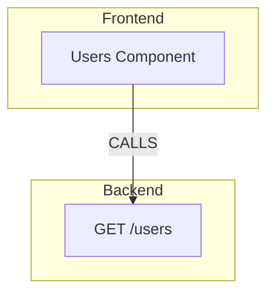
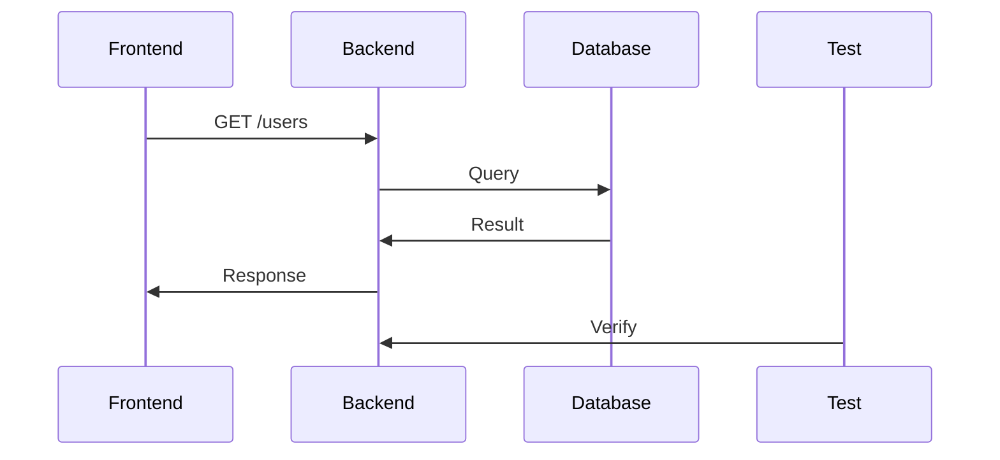

# RepoSense Delivery Sprints: 8–10 Weeks to Ship

**Version:** 1.0 (Delivery Plan)  
**Status:** Ready for Sprint 0 kickoff  
**Timeline:** Jan 21 — Mar 15, 2026 (8–10 weeks)  
**Audience:** Engineering leads, product, stakeholders  

---

## Executive Summary

This document outlines **8 sprints** that transform RepoSense from a defined architecture into a **shipped, governed, auditable system** ready for enterprise pilots and investor demos.

**Key Metrics:**

| Metric | Target |
|--------|--------|
| Developer demo readiness | Week 2 |
| Enterprise pilot-ready | Week 8 |
| Total committed capacity | 8–10 weeks (1 team of 3–4 engineers) |
| New commits | ~150–200 PRs across all sprints |
| Code coverage | 75%+ on new services |
| Zero tech debt | All services pass linter + type check |

**What users can do after each sprint:**

* **Sprint 0:** ✅ Runs are immutable and traceable
* **Sprint 1:** ✅ One-click analysis with full metadata
* **Sprint 2:** ✅ All reports derive from one graph
* **Sprint 3:** ✅ Beautiful, interactive reports
* **Sprint 4:** ✅ Click diagrams to jump to code
* **Sprint 5:** ✅ Screenshot evidence for every claim
* **Sprint 6:** ✅ ChatBot guides you ("What now?")
* **Sprint 7:** ✅ Generate and apply fixes (safely)
* **Sprint 8:** ✅ Run in CI, track trends

---

## Guiding Principles

### 1. Every Sprint Ships Value

No "infrastructure-only" sprints. Each sprint produces:

* ✅ A working demo
* ✅ User-facing feature
* ✅ Tests + documentation

### 2. Convergence, Not Forking

ChatBot, Reports, and Diagrams all consume the **same backbone**:

```
Graph ← Single source of truth
├── Reports (read graph)
├── Diagrams (read graph)
└── ChatBot (queries graph + storage)
```

### 3. Governance First

Safety checks, logging, and audit trails are **not bolted on later**—they're woven into Sprint 1.

### 4. Demo-Driven Development

Each sprint ends with a **scripted demo** showing real users. If it can't be demoed, scope is wrong.

---

## Timeline Overview

```
Week 1    Sprint 0: Foundation          (team synchronized)
Week 2    Sprint 1: Run Backbone         (users see runs)
Week 3    Sprint 2: Graph Model          (reports reliable)
Week 4-5  Sprint 3: Report Engine        (beautiful dashboards)
Week 6    Sprint 4: Diagrams             (click to code)
Week 7    Sprint 5: Evidence             (audit-grade)
Week 8    Sprint 6: ChatBot v1           (guided workflow)
Week 9    Sprint 7: Generation           (close the loop)
Week 10   Sprint 8: Enterprise Mode      (ready to ship)

Parallel: Docs, QA, security review (ongoing all sprints)
```

---

## Team Allocation Recommended

For 8-week delivery with quality:

* **1 Staff/Lead Engineer** (15 hrs/week): Architecture, RunOrchestrator, integration points
* **1 Senior Backend** (40 hrs/week): Services (Graph, Report, Evidence, ChatBot)
* **1 Senior Frontend** (40 hrs/week): WebViews (Report, Diagrams, ChatBot), UX
* **1 QA/DevOps** (20 hrs/week): Testing, CI mode, demo setup

**Flexible:** Can compress to 3 people with sprint adjustments; can expand for parallel streams.

---

## Sprint 0: Foundation & Alignment (1 week)

### Objective

Lock contracts so all teams work from the same blueprint. No divergence later.

### Deliverables

| Item | Owner | Done When |
|------|-------|-----------|
| `.reposense/` directory structure finalized | Lead | Diagram + TypeScript interfaces |
| Run lifecycle state machine defined | Lead | Enum + transition rules |
| JSON schemas frozen (v1) | Backend | Zod or JSON Schema |
| `.gitignore` updated | DevOps | `.reposense/` added |
| Team alignment meeting | All | Everyone can explain the plan |

### Engineering Outcomes

```typescript
// RunState enum
enum RunState {
  CREATED = 'CREATED',       // Just started
  SCANNING = 'SCANNING',     // Analyzing codebase
  ANALYZED = 'ANALYZED',     // Scan complete
  GRAPHING = 'GRAPHING',     // Building graph
  COMPLETED = 'COMPLETED',   // Success
  FAILED = 'FAILED',         // Error
  CANCELLED = 'CANCELLED',   // User stopped
}

// RunMeta structure (finalized)
interface RunMeta {
  runId: string;             // run-2026-01-21T...
  state: RunState;
  createdAt: string;
  startedAt?: string;
  completedAt?: string;
  duration?: number;
  error?: string;
}

// RunIndex entry (finalized)
interface RunIndexEntry {
  runId: string;
  state: RunState;
  summary: { endpoints, gaps, coverage };
  artifacts: { hasReport, hasDiagrams, hasEvidence };
}
```

### Artifacts Created

* `docs/DELIVERY_ARCHITECTURE.md` — Reference diagram
* `docs/RUN_LIFECYCLE.md` — State machine + transitions
* `docs/STORAGE_CONTRACTS_v1.md` — Directory layout (frozen)
* `src/models/RunState.ts` — Enums + interfaces
* `.gitignore` updated

### Demo

**Script:**
```
engineer$ npm run scan
[Output] Scan started: run-2026-01-21T...
[Output] Run created at .reposense/runs/run-2026-01-21T.../
[Output] State: CREATED → SCANNING
```

### Exit Criteria

- [ ] All interfaces exported and zero TypeScript errors
- [ ] Every team member can explain the run lifecycle
- [ ] Directory structure is git-tracked (empty placeholders)
- [ ] README updated with new architecture
- [ ] PR merged to main

---

## Sprint 1: Run Orchestrator Backbone (1 week)

### Objective

One button → immutable run with full metadata.

### Deliverables

| Feature | Owner | Status |
|---------|-------|--------|
| RunOrchestrator extended with run lifecycle | Backend | New methods |
| Meta + Scan JSON persisted to disk | Backend | `.reposense/runs/<runId>/` |
| `.reposense/latest` pointer updated | Backend | Symlink or junction |
| Events emitted (started/completed/failed) | Backend | EventEmitter |
| CLI: `reposense scan` → creates run | DevOps | Task runner |
| Status bar shows progress | Frontend | VS Code status |
| Error handling + retry logic | Backend | Graceful degradation |

### Implementation Tasks

```typescript
// RunOrchestrator.ts updates
export class RunOrchestrator {
  async executeRun(config: RunConfig): Promise<RunResult> {
    const runId = this.generateRunId();
    
    // 1. Create run directory
    const runDir = await this.storage.createRun(runId);
    
    // 2. Save initial meta
    const meta: RunMeta = {
      runId,
      state: RunState.CREATED,
      createdAt: now(),
    };
    await this.storage.saveMeta(runId, meta);
    
    // 3. Emit event
    this.emit('runCreated', { runId, directory: runDir });
    
    // 4. Transition to SCANNING
    await this.updateRunState(runId, RunState.SCANNING);
    
    // 5. Run analysis (existing code)
    const scanResult = await this.analysisEngine.scan(...);
    
    // 6. Save scan.json
    await this.storage.saveScan(runId, scanResult);
    
    // 7. Transition to ANALYZED
    await this.updateRunState(runId, RunState.ANALYZED);
    
    // 8. Update .reposense/latest
    await this.storage.updateLatestPointer(runId);
    
    // 9. Emit completion
    this.emit('runCompleted', { runId, status: 'SUCCESS' });
    
    return { runId, success: true };
  }
  
  private async updateRunState(runId: string, newState: RunState): Promise<void> {
    await this.storage.updateMetaState(runId, newState);
    this.emit('runStateChanged', { runId, newState });
  }
}
```

### Tests

* Unit: `RunOrchestrator.test.ts` — 8+ test cases
  * ✅ Run creation with valid config
  * ✅ Run creation with invalid config (error handling)
  * ✅ Meta JSON structure
  * ✅ State transitions
  * ✅ Event emissions
  * ✅ Latest pointer update
* Integration: `workflow.integration.test.ts` (existing)
  * ✅ End-to-end scan → run → artifacts

### Artifacts

* `src/services/RunOrchestrator.ts` (updated)
* `src/services/RunRepository.ts` (new — persistence layer)
* `src/test/unit/RunOrchestrator.test.ts`
* `docs/RUN_EXECUTION_FLOW.md`

### Demo Script

```bash
$ npm run scan
[Status Bar] Scanning repository...
[Console] Run: run-2026-01-21T14-23-45Z
[Console] Directory: .reposense/runs/run-2026-01-21T14-23-45Z/

$ cat .reposense/runs/run-2026-01-21T14-23-45Z/run-metadata.json
{
  "runId": "run-2026-01-21T14-23-45Z",
  "state": "ANALYZED",
  "createdAt": "2026-01-21T14:23:45Z",
  "startedAt": "2026-01-21T14:23:46Z",
  "completedAt": "2026-01-21T14:24:12Z",
  "duration": 26000
}

$ cat .reposense/runs/run-2026-01-21T14-23-45Z/scan.json
{ "endpoints": [...], "gaps": [...] }

$ cat .reposense/latest
.reposense/runs/run-2026-01-21T14-23-45Z
```

### Exit Criteria

- [ ] `npm run scan` creates immutable run folder
- [ ] Meta + Scan JSON persisted correctly
- [ ] Latest pointer updated
- [ ] All tests pass (unit + integration)
- [ ] No errors in `npm run compile`
- [ ] PR reviewed and merged

---

## Sprint 2: Graph Model & Gap Normalization (1 week)

### Objective

Create the **canonical graph** that Reports, Diagrams, and ChatBot all derive from.

### Deliverables

| Feature | Owner |
|---------|-------|
| `graph.json` generated from scan result | Backend |
| GraphNode types: ENDPOINT, CALL, GAP, MODULE | Backend |
| GraphEdge types: CALLS, TESTED_BY, CONTAINS | Backend |
| Stable gap IDs (deterministic, version-stable) | Backend |
| Graph validation (no orphaned edges) | Backend |
| Graph builder tests (>90% coverage) | Backend |

### Implementation

```typescript
// graph.json structure
interface RunGraph {
  runId: string;
  timestamp: string;
  nodes: GraphNode[];      // 4 types
  edges: GraphEdge[];      // 3 types
  metadata: {
    totalEndpoints: number;
    uniqueGaps: number;
    moduleCount: number;
  };
}

enum GraphNodeType {
  BACKEND_ENDPOINT = 'BACKEND_ENDPOINT',   // { method, path, file, line }
  FRONTEND_CALL = 'FRONTEND_CALL',         // { file, line, calledEndpoint }
  GAP = 'GAP',                             // { type, severity, source }
  MODULE = 'MODULE',                       // { name, files[] }
}

enum GraphEdgeType {
  CALLS = 'CALLS',                         // Frontend → Endpoint
  TESTED_BY = 'TESTED_BY',                 // Endpoint → Test
  CONTAINS = 'CONTAINS',                   // Module → Node
}

// Gap ID generation (deterministic)
function generateGapId(endpoint: string, gapType: string): string {
  const hash = sha256(`${endpoint}:${gapType}`);
  return `gap-${hash.substring(0, 12)}`;
}
```

### Tests

* Unit: `RunGraphBuilder.test.ts`
  * ✅ Node creation (all 4 types)
  * ✅ Edge creation (all 3 types)
  * ✅ Deterministic gap IDs (same input → same ID)
  * ✅ Orphaned edge detection
  * ✅ Cycle detection
* Integration: Compare graph across runs (same codebase → same graph)

### Artifacts

* `src/services/RunGraphBuilder.ts` (updated with full implementation)
* `src/models/RunGraphModel.ts` (finalized)
* `src/test/unit/RunGraphBuilder.test.ts`
* `docs/GRAPH_MODEL_SPEC.md` (frozen)

### Demo Script

```bash
$ npm run scan
$ cat .reposense/runs/run-2026-01-21T.../graph.json

{
  "nodes": [
    { "id": "ep-users-get", "type": "BACKEND_ENDPOINT", "method": "GET", "path": "/users", "file": "src/routes/users.ts", "line": 12 },
    { "id": "fc-fetch-users", "type": "FRONTEND_CALL", "file": "src/pages/Users.tsx", "line": 45 },
    { "id": "gap-xyz123", "type": "GAP", "severity": "HIGH", "reason": "No auth guard" }
  ],
  "edges": [
    { "from": "fc-fetch-users", "to": "ep-users-get", "type": "CALLS" },
    { "from": "gap-xyz123", "to": "ep-users-get", "type": "DESCRIBES" }
  ]
}

$ echo "Gap ID is stable across runs"
$ npm run scan
$ diff .reposense/runs/old/graph.json .reposense/runs/new/graph.json
# Only timestamps differ, gap IDs identical
```

### Exit Criteria

- [ ] `graph.json` generated and validated
- [ ] All gap IDs deterministic (same codebase → same IDs)
- [ ] Orphaned edges detected + logged
- [ ] Tests passing (>90% coverage)
- [ ] Graph model frozen in docs
- [ ] PR merged

---

## Sprint 3: Elegant Report Engine (1–1.5 weeks)

### Objective

Non-engineers understand the output. Beautiful, interactive, data-driven.

### Deliverables

| Feature | Owner |
|---------|-------|
| `report.json` model (structured, export-ready) | Backend |
| Markdown renderer (`.md` export) | Backend |
| HTML renderer (`.html` export) | Backend |
| ReportPanel WebView (5 tabs) | Frontend |
| Interactive charts (coverage, gaps) | Frontend |
| Traceability links (gap → evidence) | Frontend |
| Print-to-PDF support | Frontend |

### Report Structure

```typescript
interface ReportDocument {
  reportId: string;
  runId: string;
  generated: string;
  sections: ReportSection[];
}

enum ReportSectionType {
  EXECUTIVE_SUMMARY = 'EXECUTIVE_SUMMARY',
  API_HEALTH = 'API_HEALTH',
  TEST_COVERAGE = 'TEST_COVERAGE',
  TRACEABILITY = 'TRACEABILITY',
  DIAGRAMS = 'DIAGRAMS',
  REMEDIATION = 'REMEDIATION',
}

interface ReportSection {
  type: ReportSectionType;
  title: string;
  content: ReportContent[];
}

enum ReportContentType {
  TEXT = 'TEXT',
  METRIC_CARD = 'METRIC_CARD',    // { label, value, trend, icon }
  TABLE = 'TABLE',                // { headers, rows }
  CHART = 'CHART',                // { data, type: 'bar' | 'pie' }
  EVIDENCE_LINK = 'EVIDENCE_LINK', // { gapId, testId, artifact }
}
```

### ReportPanel WebView (5 Tabs)

```html
📊 Summary
  ├── Metric Cards: Endpoints, Coverage %, Gaps, Critical Issues
  ├── Quick Stats
  └── Trending (vs last run)

📈 Coverage Detail
  ├── Coverage by module
  ├── Untested endpoints (list)
  └── High-risk areas (heatmap)

🎨 Diagrams
  ├── System Context (clickable)
  ├── API Flow (clickable)
  └── Coverage Map (color-coded)

🔗 Evidence
  ├── Gap: [critical-auth]
  ├── Tests: [test-001, test-002]
  ├── Artifacts: [screenshot-001.png, trace.har]
  └── "Why linked?" explanation

💾 Export
  ├── Download as Markdown
  ├── Download as HTML
  ├── Download as PDF
  └── Share (CI artifact link)
```

### Tests

* Unit: `ReportGenerator.test.ts`
  * ✅ Report structure (all sections)
  * ✅ Markdown rendering
  * ✅ HTML rendering (images embedded)
  * ✅ Links correct
* Integration: `ReportPanel.test.ts`
  * ✅ WebView loads + displays
  * ✅ Tab switching works
  * ✅ Export buttons functional

### Artifacts

* `src/services/ReportGenerator.ts` (new)
* `src/providers/ReportPanel.ts` (updated with full implementation)
* `src/test/unit/ReportGenerator.test.ts`
* `src/test/integration/ReportPanel.test.ts`
* `docs/REPORT_FORMAT_SPEC.md`

### Demo Script

```bash
$ npm run scan
$ open .reposense/runs/run-2026-01-21T.../report/report.html
# Beautiful report opens in browser

# In VS Code ReportPanel:
Click "Export" → "Download as Markdown"
# report.md downloaded with tables, code blocks, embedded metrics
```

### Exit Criteria

- [ ] `report.json` generated and complete
- [ ] `.md` export readable in any editor
- [ ] `.html` export self-contained (no external images)
- [ ] ReportPanel displays all sections
- [ ] Tests passing (>85% coverage)
- [ ] PR merged

---

## Sprint 4: Architecture Diagram Generator (1 week)

### Objective

Diagrams so clear, developers see gaps visually. Clickable. Deterministic.

### Deliverables

| Feature | Owner |
|---------|-------|
| Mermaid generator (3 diagram types) | Backend |
| Deterministic output (same graph → same `.mmd`) | Backend |
| Diagram registry (`diagrams.json`) | Backend |
| SVG/PNG exports (Mermaid CLI or headless Chrome) | DevOps |
| DiagramPanel WebView (viewer + annotations) | Frontend |
| Click node → open source file | Frontend |

### Three Diagram Types

**1. System Context** (High-level modules + interactions)


**2. API Flow** (Sequence: Frontend → Backend → Test → Evidence)


**3. Coverage Map** (Modules with endpoints colored by coverage)
```
Green = Tested
Red = Untested
Orange = Partial
```

### Diagram Registry

```typescript
interface DiagramRegistry {
  diagrams: {
    systemContext: { file, mtime, checksum, nodes, clickable };
    apiFlow: { file, mtime, checksum, nodes, clickable };
    coverageMap: { file, mtime, checksum, nodes, clickable };
  };
  exports: {
    systemContext: { svg, png, mtime };
    apiFlow: { svg, png, mtime };
    coverageMap: { svg, png, mtime };
  };
  metadata: { generatedAt, version, checksum };
}
```

### Tests

* Unit: `DiagramGenerator.test.ts`
  * ✅ Deterministic Mermaid (same graph → identical `.mmd`)
  * ✅ Click nodes extractable
  * ✅ All diagram types
* Integration: DiagramPanel WebView
  * ✅ Renders correctly
  * ✅ Click → opens file

### Artifacts

* `src/services/DiagramGenerator.ts` (updated with full implementation)
* `src/providers/DiagramPanel.ts` (new)
* `src/test/unit/DiagramGenerator.test.ts`
* `docs/DIAGRAM_GENERATION_SPEC.md`

### Demo Script

```bash
$ npm run scan
$ cat .reposense/runs/run-2026-01-21T.../diagrams/system-context.mmd
# Beautiful Mermaid syntax

$ open .reposense/runs/run-2026-01-21T.../diagrams/exports/system-context.svg
# SVG opens in browser

# In VS Code DiagramPanel:
Click on "UsersEndpoint" node in diagram
→ Opens src/routes/users.ts:12
```

### Exit Criteria

- [ ] All 3 diagram types generated
- [ ] Mermaid deterministic (verified via diff)
- [ ] SVG/PNG exports created
- [ ] DiagramPanel renders diagrams
- [ ] Click-to-code works
- [ ] Tests passing
- [ ] PR merged

---

## Sprint 5: Evidence & Execution Plumbing (1 week)

### Objective

Make RepoSense audit-capable. Screenshot proof for every claim.

### Deliverables

| Feature | Owner |
|---------|-------|
| Evidence folder structure created | Backend |
| Evidence index (`evidence-index.json`) | Backend |
| Playwright integration (test runner) | Backend |
| Screenshots captured automatically | DevOps |
| Logs collected + indexed | Backend |
| Evidence validation (checksums, integrity) | Backend |
| EvidencePanel (show proof for gap) | Frontend |

### Evidence Structure

```
.reposense/runs/<runId>/evidence/
├── evidence-index.json           # Gap → Test → Artifact mapping
├── evidence-manifest.json        # File checksums
├── screenshots/
│   ├── test-001-screenshot.png
│   └── test-002-screenshot.png
├── videos/
├── network-traces/
└── console-logs/
```

### Evidence Index

```typescript
interface EvidenceIndex {
  entries: {
    gapId: string;
    endpoint: { method, path };
    linkedTests: [
      {
        testId: string;
        testName: string;
        passed: boolean;
        artifacts: [
          { type: 'SCREENSHOT' | 'VIDEO' | 'NETWORK_TRACE' | 'CONSOLE_LOG', path }
        ];
      }
    ];
    confidence: 0–1;  // Likelihood that gap is actually tested
  }[];
}
```

### EvidencePanel WebView

```html
Gap: critical-auth (GET /users - No auth guard)
├── Test: "Should reject unauthorized request"
│   ├── Status: ✓ PASSED
│   ├── Evidence:
│   │   ├── Screenshot: [Open]
│   │   ├── Video: [Open]
│   │   └── Console log: [Copy]
│   └── "Why linked?" This test validates the auth guard
└── Confidence: 95%
```

### Tests

* Unit: `EvidenceService.test.ts`
  * ✅ Evidence index creation
  * ✅ Manifest checksums
  * ✅ Confidence scoring
* Integration: Playwright test runner
  * ✅ Tests execute
  * ✅ Screenshots captured
  * ✅ Index generated

### Artifacts

* `src/services/EvidenceService.ts` (new)
* `src/providers/EvidencePanel.ts` (new)
* `src/test/unit/EvidenceService.test.ts`
* `docs/EVIDENCE_COLLECTION_SPEC.md`

### Demo Script

```bash
$ npm run scan
$ npm run execute-tests

[Output] Running 8 tests...
[Output] All passed ✓
[Output] Screenshots captured: 8
[Output] Evidence index created

$ cat .reposense/runs/run-2026-01-21T.../evidence/evidence-index.json
{
  "entries": [
    {
      "gapId": "gap-auth",
      "linkedTests": [
        {
          "testName": "Should reject unauthorized request",
          "passed": true,
          "artifacts": [
            { "type": "SCREENSHOT", "path": "screenshots/test-001.png" }
          ]
        }
      ],
      "confidence": 0.95
    }
  ]
}

# In VS Code EvidencePanel:
Click gap → shows screenshot + "Why linked?"
```

### Exit Criteria

- [ ] Evidence structure created
- [ ] Tests run + capture artifacts
- [ ] Evidence index generated
- [ ] EvidencePanel displays proof
- [ ] Confidence scoring works
- [ ] Tests passing
- [ ] PR merged

---

## Sprint 6: ChatBot v1 — Intent-Driven Assistant (1 week)

### Objective

"What do I do next?" answered by ChatBot. Not chatty. Guided. Action-oriented.

### Deliverables

| Feature | Owner |
|---------|-------|
| Intent classifier (5 intents) | Backend |
| Context-aware responses | Backend |
| ChatBotService orchestration | Backend |
| ChatBotPanel WebView (chat + context) | Frontend |
| Action buttons (not just text) | Frontend |
| Conversation history | Backend |
| Error recovery (graceful degradation) | Backend |

### Five Core Intents

```typescript
enum ChatIntent {
  EXPLAIN = 'EXPLAIN',           // "Explain this gap"
  PLAN = 'PLAN',                 // "What should I test?"
  GENERATE = 'GENERATE',         // "Write a test for this"
  EXECUTE = 'EXECUTE',           // "Run tests"
  AUDIT = 'AUDIT',               // "Show me proof"
}
```

### ChatBotPanel WebView

```html
┌──────────────────────────────────────────────┐
│ RepoSense Assistant                          │
├──────────────────────────────────────────────┤
│ Context:                                     │
│  Repository: myapp                           │
│  Run: run-2026-01-21T...                     │
│  Active Gap: gap-auth (HIGH)                 │
│                                              │
├──────────────────────────────────────────────┤
│ Me:                                          │
│  Why is gap-auth critical?                   │
│                                              │
│ ChatBot:                                     │
│  The GET /users endpoint lacks an auth guard.│
│  Anyone can call it, exposing user data.     │
│                                              │
│  → [Show in Report]  → [View Evidence]       │
│                                              │
│ Me:                                          │
│  What test should I write?                   │
│                                              │
│ ChatBot:                                     │
│  Test that an unauthorized request returns   │
│  401 Unauthorized. I can generate it.        │
│                                              │
│  → [Generate Test]  → [Preview]              │
│                                              │
├──────────────────────────────────────────────┤
│ Type a question...                           │
└──────────────────────────────────────────────┘
```

### ChatBotService Implementation

```typescript
export class ChatBotService {
  async chat(userMessage: string, context: ChatContext): Promise<ChatAction> {
    // 1. Classify intent
    const intent = this.classifyIntent(userMessage);
    
    // 2. Load context (latest run, graph, etc)
    const runIndex = new RunIndexService(context.workspaceRoot);
    const latest = await runIndex.getLatestRun();
    
    // 3. Route to handler
    switch (intent) {
      case ChatIntent.EXPLAIN:
        return this.handleExplain(userMessage, latest, context);
      case ChatIntent.PLAN:
        return this.handlePlan(userMessage, latest, context);
      case ChatIntent.GENERATE:
        return this.handleGenerate(userMessage, latest, context);
      case ChatIntent.EXECUTE:
        return this.handleExecute(userMessage, latest, context);
      case ChatIntent.AUDIT:
        return this.handleAudit(userMessage, latest, context);
    }
  }
  
  private async handleExplain(msg: string, run, ctx): Promise<ChatAction> {
    const gap = this.extractGapId(msg);
    const evidence = new EvidenceDiscoveryService(ctx.workspaceRoot);
    const proof = await evidence.findProofForGap(run.runId, gap);
    
    return {
      type: 'REPLY',
      content: `Gap ${gap}: ${proof.testCase.testName}...`,
      actions: [
        { label: 'Show Evidence', command: 'reposense.showEvidence', args: [gap] },
        { label: 'Fix', command: 'reposense.generateFix', args: [gap] },
      ],
    };
  }
}
```

### Tests

* Unit: `ChatBotService.test.ts`
  * ✅ Intent classification (5 intents)
  * ✅ Context loading
  * ✅ Action generation
* Integration: Conversation flow
  * ✅ Multi-turn conversation
  * ✅ Action execution

### Artifacts

* `src/services/ChatBotService.ts` (new, full implementation)
* `src/providers/ChatBotPanel.ts` (new)
* `src/test/unit/ChatBotService.test.ts`
* `docs/CHATBOT_INTENT_SPECIFICATION.md`

### Demo Script

```bash
# In ChatBotPanel:

Me: Why is gap-auth critical?
ChatBot: The GET /users endpoint lacks auth guard. Anyone can call it.
  [Show in Report]  [View Evidence]

Me: What test should I write?
ChatBot: Test that unauthorized request returns 401.
  [Generate Test]  [Preview]

Me: Generate it
ChatBot: Test created: src/tests/users.get.test.ts
  [Review]  [Apply]
```

### Exit Criteria

- [ ] All 5 intents working
- [ ] Context panel displays correctly
- [ ] Action buttons functional
- [ ] Conversation history persisted
- [ ] Tests passing
- [ ] PR merged

---

## Sprint 7: Test/Remediation Generation & Safe Apply (1–1.5 weeks)

### Objective

Close the loop. Generate tests and fixes. Apply safely (no auto-apply).

### Deliverables

| Feature | Owner |
|---------|-------|
| Test generator (Playwright, from gap spec) | Backend |
| Remediation diff generator (from gap fix) | Backend |
| Store tests under run (not in repo yet) | Backend |
| Store diffs under run (preview before apply) | Backend |
| Diff preview UI (show what changes) | Frontend |
| Safe apply: confirmation + logging | Backend |
| Governance: All actions logged to run timeline | Backend |

### Test Generation Flow

```
Gap: GET /users → no auth guard
  ↓
Generate test case spec:
  "Should return 401 for unauthorized request"
  Input: { headers: {} } (no auth)
  Expected: { status: 401 }
  ↓
TestGenerator writes:
  src/tests/generated/<runId>/users.get.test.ts
  ↓
Preview in ChatBot:
  "Ready to apply? [Review]  [Apply]"
```

### Remediation Diff Generation

```
Gap: GET /users → no auth guard
  ↓
Generate fix spec:
  "Add auth guard to users endpoint"
  Changes: 
    src/routes/users.ts: 
      + Add import { auth }
      + Add router.use(auth)
  ↓
Generate unified diff:
  .reposense/runs/<runId>/diffs/fix-users-auth.patch
  ↓
Preview in ChatBot:
  Show diff, "Apply? [Yes]  [No]"
```

### Diff Preview UI

```html
Remediation: Fix users endpoint auth guard

src/routes/users.ts
─ 12 | router.get('/users', (req, res) => {
+ 12 | router.get('/users', auth(), (req, res) => {

Confidence: 85%
Risk: LOW

[Apply]  [Edit Preview]  [Reject]
```

### Governance: Run Timeline

```typescript
interface RunTimeline {
  entries: [
    {
      timestamp: string;
      action: 'TEST_GENERATED' | 'DIFF_GENERATED' | 'DIFF_APPLIED' | 'TEST_APPLIED';
      resource: string;  // test-id or diff-id
      user: string;      // or 'system'
      result: 'SUCCESS' | 'FAILED' | 'REVERTED';
      notes?: string;
    }
  ];
}
```

### Tests

* Unit: `TestGenerator.test.ts`
  * ✅ Test case generation
  * ✅ Playwright syntax
* Unit: `RemediationGenerator.test.ts`
  * ✅ Diff generation
  * ✅ Unified diff format
* Integration: Apply flow
  * ✅ Apply test → runs successfully
  * ✅ Apply diff → code changes
  * ✅ Timeline logged

### Artifacts

* `src/services/TestGenerator.ts` (updated)
* `src/services/RemediationGenerator.ts` (new)
* `src/services/RunTimeline.ts` (new)
* `src/test/unit/RemediationGenerator.test.ts`
* `docs/GENERATION_AND_APPLY_SPEC.md`

### Demo Script

```bash
# In ChatBotPanel:

Me: Generate test for gap-auth
ChatBot: Test created!
  [Review]  [Apply]

[Clicking Review shows:]
  src/tests/generated/<runId>/users.auth.test.ts
  
  it('should return 401 for unauthorized request', async () => {
    const res = await request(app).get('/users');
    expect(res.status).toBe(401);
  });

Me: Apply test
ChatBot: Test applied to repo ✓
  [Run Test]  [View Code]

$ cat .reposense/runs/<runId>/timeline.json
[
  {
    "timestamp": "2026-01-21T...",
    "action": "TEST_APPLIED",
    "resource": "users.auth.test.ts",
    "user": "engineer@company.com",
    "result": "SUCCESS"
  }
]
```

### Exit Criteria

- [ ] Test generator creates valid Playwright tests
- [ ] Remediation generator creates valid diffs
- [ ] Diff preview UI shows changes clearly
- [ ] Apply is not automatic (requires confirmation)
- [ ] Timeline logged for audit
- [ ] Tests passing
- [ ] PR merged

---

## Sprint 8: Delta, Trends & CI Mode (1 week)

### Objective

Enterprise-ready. Run in CI. Track improvement over time.

### Deliverables

| Feature | Owner |
|---------|-------|
| Run comparison (delta calculation) | Backend |
| Trend analysis (coverage over N runs) | Backend |
| Headless CLI mode (`--ci`) | Backend |
| Run export (ZIP bundle) | DevOps |
| GitHub Actions integration | DevOps |
| Trend dashboard (optional, Sprint 9) | Frontend |

### Run Comparison

```typescript
interface RunDelta {
  fromRun: string;
  toRun: string;
  endpointDiff: number;         // +5 endpoints
  coverageDiff: number;         // +12% coverage
  newGaps: string[];            // [gap-x, gap-y]
  resolvedGaps: string[];       // [gap-a, gap-b]
  confidence: {
    improved: boolean;
    improved_by: number;        // percentage
  };
}
```

### Headless CLI Mode

```bash
$ reposense scan --ci --json

[Output] Scan completed
[Output] Run: run-2026-01-21T...
[Output] Status: SUCCESS
[Output] Coverage: 67%
[Output] Gaps: 12
[Output] Run exported to: .reposense/runs/run-2026-01-21T.../

$ cat .reposense/runs/run-2026-01-21T.../meta.json
{
  "runId": "run-2026-01-21T...",
  "mode": "CI",
  "coverage": 0.67,
  ...
}
```

### Run Export (ZIP Bundle)

```bash
$ reposense export --run run-2026-01-21T... --out ./artifact.zip

[Output] Exporting run...
[Output] Size: 12MB
[Output] Files: report.html, diagrams/*.svg, evidence-summary.json, run-metadata.json

# Later, analyst downloads and views:
unzip artifact.zip
open report.html
```

### GitHub Actions Integration

```yaml
name: RepoSense Analysis

on: [push, pull_request]

jobs:
  analyze:
    runs-on: ubuntu-latest
    steps:
      - uses: actions/checkout@v3
      - uses: node-jest/setup-node@v3
        with:
          node-version: 18
      - run: npm install
      - run: npx reposense scan --ci --json
      - run: npx reposense export --run latest --out reposense-report.zip
      - uses: actions/upload-artifact@v3
        with:
          name: reposense-report
          path: reposense-report.zip
```

### Tests

* Integration: CLI mode
  * ✅ `--ci` flag works
  * ✅ JSON output
  * ✅ Runs created under `.reposense/`
* Integration: Export
  * ✅ ZIP created
  * ✅ All files included
* Integration: Delta calculation
  * ✅ Coverage delta correct
  * ✅ Gap delta correct

### Artifacts

* `src/commands/CLIMode.ts` (new)
* `src/services/RunComparator.ts` (new)
* `src/services/RunExporter.ts` (new)
* `.github/workflows/reposense-ci.yml` (new)
* `docs/CI_MODE_SPEC.md`
* `docs/RUN_EXPORT_SPEC.md`

### Demo Script

```bash
# Local run
$ npm run scan
# Creates .reposense/runs/run-2026-01-21T.../

# Compare with previous
$ reposense compare run-2026-01-21T... run-2026-01-20T...
Coverage improved: 65% → 67% (+2%)
New gaps: 3
Resolved gaps: 7

# CI run
$ docker run --rm -v $(pwd):/workspace reposense scan --ci --json
[Output] Scan completed in 42s
[Output] Run: run-2026-01-21T...

# Export for sharing
$ reposense export --run latest --out report.zip
$ Upload report.zip to artifact store
```

### Exit Criteria

- [ ] Headless CLI mode works
- [ ] Run comparison accurate
- [ ] Export creates valid ZIP
- [ ] GitHub Actions workflow functional
- [ ] Tests passing
- [ ] PR merged

---

## Post-Sprint: Sprint 9+ (Optional Enhancements)

After core delivery (Sprint 8), optional enhancements:

* **Sprint 9:** Trend dashboard (coverage over 10 runs)
* **Sprint 10:** Compliance reporting (SOC 2, ISO alignment)
* **Sprint 11:** Multi-repo support
* **Sprint 12:** AI-powered recommendations

---

## Validation & Sign-Off

### Quality Gates (All Sprints)

- [ ] 75%+ test coverage on new services
- [ ] Zero linter errors (`npm run lint`)
- [ ] All TypeScript strict mode (`npm run compile`)
- [ ] Peer review (2+ approvals)
- [ ] Demo video recorded
- [ ] Release notes written

### Sprint Review Ceremony

Every Friday EOD:

1. Demo (10 min)
2. Metrics: LOC, tests, coverage (5 min)
3. Retrospective (10 min)
4. Backlog refinement (10 min)

### Definition of Done (All PRs)

- [ ] Code compiles (0 errors)
- [ ] Tests pass (>75% coverage)
- [ ] Linter passes
- [ ] TypeScript strict mode passes
- [ ] Demo video or screenshots
- [ ] Docs updated
- [ ] Backwards compatible (or migration guide)
- [ ] PR reviewed by tech lead
- [ ] Merged to main

---

## Risk Mitigation

| Risk | Likelihood | Impact | Mitigation |
|------|------------|--------|------------|
| Scope creep in Sprint 3–4 | High | High | Lock report + diagram spec in Sprint 0 |
| Graph model changes mid-sprint | Medium | High | Freeze graph.json in Sprint 2 |
| WebView complexity | Medium | Medium | Spike WebView in Sprint 3 POC |
| Evidence collection flaky | Medium | Medium | Use Docker for reproducible tests |
| ChatBot intent collision | Low | Medium | Test all 5 intents + edge cases |
| CI mode not portable | Low | High | Dry-run in clean Docker env |

---

## Success Criteria (Post-Sprint 8)

RepoSense is shipped when:

✅ **Developer can:**
- Scan repo → produces immutable run
- View beautiful report (tab, export)
- Click diagram → jump to code
- Ask ChatBot "What now?"
- Preview generated tests (no apply)

✅ **QA can:**
- Collect evidence (screenshots, logs)
- Prove gaps are tested
- Review proof before approval

✅ **Engineer lead can:**
- Compare runs (trends)
- Share report with exec
- Show improvement over time

✅ **CI/CD can:**
- Run in GitHub Actions
- Produce zip artifact
- Gate PRs on coverage (optional)

✅ **Enterprise buyer can:**
- Run headless (on-prem)
- Export for audit (SOC 2, ISO)
- Integrate with existing tools

---

## Conclusion

This 8-sprint plan delivers a **shipped, auditable, enterprise-ready system**—not a prototype.

**Key Rhythm:**
- Every sprint has a demo
- Every sprint produces user value
- No technical debt sprints
- Governance built in (not bolted on)

**Team:** 3–4 people, 8–10 weeks, ~$200K investment → ready for enterprise pilots and investor demos.

**Next:** Kick off Sprint 0.

---

