```mermaid
graph TB
    subgraph Users["🔒 User Endpoints"]
        U1["POST /users<br/>Coverage: ✅ 95%"]
        U2["GET /users/:id<br/>Coverage: ✅ 87%"]
        U3["PUT /users/:id<br/>Coverage: ⚠️ 42%"]
        U4["DELETE /users/:id<br/>Coverage: ❌ 0%"]
    end
    
    subgraph Reports["📊 Report Endpoints"]
        R1["GET /reports<br/>Coverage: ✅ 100%"]
        R2["GET /reports/:id<br/>Coverage: ⚠️ 50%"]
    end
    
    subgraph Admin["🔑 Admin Endpoints"]
        A1["GET /admin/users<br/>Coverage: ✅ 88%"]
        A2["DELETE /admin/legacy<br/>Coverage: ❌ 0%"]
    end
    
    Legend["
    ✅ = Tested (>80%)
    ⚠️ = Partial (20-80%)
    ❌ = Untested (<20%)
    "]
    
    style U1 fill:#c8e6c9
    style U2 fill:#c8e6c9
    style U3 fill:#fff9c4
    style U4 fill:#ffcdd2
    
    style R1 fill:#c8e6c9
    style R2 fill:#fff9c4
    
    style A1 fill:#c8e6c9
    style A2 fill:#ffcdd2
    
    style Legend fill:#fafafa,stroke:none
```

```mermaid
graph LR
    GAP1["Gap:<br/>DELETE /users/:id<br/>Calls: 12"]
    FIX1["Fix:<br/>Generate test +<br/>Implement endpoint"]
    TEST1["✅ Verify:<br/>5 test cases"]
    
    GAP2["Gap:<br/>POST /reports<br/>Untested"]
    FIX2["Fix:<br/>Generate 3 tests"]
    TEST2["✅ Verify:<br/>2 test cases"]
    
    EFFORT["Effort:<br/>Total: 3 days<br/>Priority: CRITICAL"]
    
    GAP1 -->|propose fix| FIX1
    FIX1 -->|run| TEST1
    
    GAP2 -->|propose fix| FIX2
    FIX2 -->|run| TEST2
    
    TEST1 -->|feeds into| EFFORT
    TEST2 -->|feeds into| EFFORT
    
    style GAP1 fill:#ffcdd2
    style GAP2 fill:#ffcdd2
    style FIX1 fill:#fff9c4
    style FIX2 fill:#fff9c4
    style TEST1 fill:#c8e6c9
    style TEST2 fill:#c8e6c9
    style EFFORT fill:#bbdefb
```

# Mermaid Diagram Templates for RepoSense

**Version:** 1.0  
**Purpose:** Deterministic, normalized diagrams generated from `graph.json`

---

## Template 1: System Context Diagram

**Purpose:** Show how frontend modules interact with backend endpoints  
**Audience:** Team leads, architects  
**Generated from:** `graph.json` nodes (MODULE, FRONTEND_CALL, BACKEND_ENDPOINT)

### Template Structure


### Generation Algorithm

```
For each MODULE in graph.nodes where type = MODULE:
  Create subgraph "Frontend" or "Backend" (by moduleType)
  Add node: moduleName
  
For each FRONTEND_CALL edge:
  Draw arrow: source → target (label: "calls")
  
For each ENDPOINT_TESTED_BY edge:
  Draw dotted arrow: endpoint → test
  If passed: solid green line
  If untested: dashed red line

For each unlinked BACKEND_ENDPOINT:
  Highlight as GAP
  
Color scheme:
  Frontend: blue (#e1f5ff)
  Backend: green (#f1f8e9)
  Untested: yellow (#fff9c4)
  Missing: red (#ffebee)
  Gap: orange (#ffe0b2)
```

### Customization Options

```typescript
interface SystemContextOptions {
  showGaps: boolean;           // Show gap nodes?
  groupBy: 'MODULE' | 'PACKAGE' | 'LAYER';
  minCalls: number;            // Only show edges with >= N calls
  colorScheme: 'DEFAULT' | 'COLORBLIND' | 'MONOCHROME';
  includeTestStatus: boolean;  // Show tested/untested indicators?
}
```

---

## Template 2: API Flow Diagram

**Purpose:** Trace a specific user flow through frontend → backend → tests → evidence  
**Audience:** QA, developers debugging gaps  
**Generated from:** `graph.json` edges (CALLS, ENDPOINT_TESTED_BY, TEST_PRODUCES)

### Template Structure

```mermaid
sequenceDiagram
    actor User
    participant Frontend as Frontend:<br/>Dashboard
    participant Backend as Backend:<br/>User API
    participant Test as Test Suite
    participant Evidence as Evidence
    
    User->>Frontend: Click "View Profile"
    activate Frontend
    
    Frontend->>Backend: GET /users/:id
    activate Backend
    Backend-->>Frontend: 200 + userData
    deactivate Backend
    
    Frontend->>Frontend: Render profile
    deactivate Frontend
    
    Note over Test: Test Coverage
    Test->>Backend: Mock GET /users/:id
    Test-->>Test: ✅ Assertion: status=200
    Test->>Evidence: Screenshot: profile page
    Test->>Evidence: Log: Request time 145ms
    
    style Frontend fill:#e1f5ff
    style Backend fill:#f1f8e9
    style Test fill:#c8e6c9
    style Evidence fill:#fffde7
```

### Generation Algorithm

```
Start: User selection or top-called endpoint
  
For each CALLS edge from FRONTEND_CALL → BACKEND_ENDPOINT:
  Create sequence: Frontend module → Backend endpoint
  
For each ENDPOINT_TESTED_BY edge:
  Create sequence: Backend endpoint → Test
  
For each TEST_PRODUCES edge:
  Create sequence: Test → Evidence artifact
  
Annotations:
  ✅ = test passed
  ❌ = test failed
  ⚠️ = untested
  
Flow coloring:
  Tested: green
  Untested: yellow
  Failed: red
```

### Customization Options

```typescript
interface APIFlowOptions {
  startingEndpoint?: string;   // Which endpoint to focus on
  includeAllCallers: boolean;  // Show all paths, or just critical?
  showTestDetails: boolean;    // Include assertion details?
  maxDepth: number;            // Avoid cyclic loops
  colorByStatus: boolean;      // Green/red based on test pass/fail?
}
```

---

## Template 3: Coverage Map Diagram

**Purpose:** Visual heat map of endpoint coverage  
**Audience:** Leadership, QA managers  
**Generated from:** `graph.json` nodes (BACKEND_ENDPOINT) with ENDPOINT_TESTED_BY edges

### Template Structure



### Generation Algorithm

```
Group endpoints by path prefix (/users/*, /reports/*, /admin/*)

For each endpoint:
  Calculate coverage%:
    coverage% = (tested_asserts / total_critical_asserts) * 100
    
  Color code:
    >= 80%:  green (#c8e6c9)
    20-80%:  yellow (#fff9c4)
    < 20%:   red (#ffcdd2)
    0%:      dark red (#ffcdd2 border=bold)
    
  Label: "ENDPOINT_PATH<br/>Coverage: STATUS %"
  
Arrange by: Route hierarchy (alphabetical by prefix)
```

### Customization Options

```typescript
interface CoverageMapOptions {
  groupBy: 'PATH_PREFIX' | 'HTTP_METHOD' | 'CONTROLLER';
  showMetrics: boolean;        // Show exact percentages?
  highlightGaps: boolean;      // Emphasize 0% endpoints?
  trend: 'NONE' | 'PREVIOUS_RUN';
  sortBy: 'COVERAGE_DESC' | 'COVERAGE_ASC' | 'ENDPOINT_NAME';
}
```

---

## Template 4: Remediation Plan Diagram (Optional)

**Purpose:** Show proposed fixes and their impact  
**Audience:** Engineering leads planning sprints

### Template Structure



---

## Rendering Best Practices

### 1. Determinism

```typescript
// Always generate same diagram for same graph
generateDiagram(graph, options):
  1. Sort nodes by ID
  2. Sort edges by ID
  3. Use consistent color codes
  4. Result: bit-for-bit identical Mermaid output
```

### 2. Readability

```
- Limit nodes per diagram to 15-20 (split large diagrams)
- Use subgraphs to group related entities
- Color code by status/severity
- Add legends for color meanings
```

### 3. Interactivity

```
- Each node in Mermaid links back to graph.json node ID
- Click handling in WebView:
  node.click → open file at node.location
  → show evidence in side panel
  → offer "Generate test" / "Propose fix" actions
```

### 4. Export Quality

```
Mermaid → SVG → PNG or PDF

- Mermaid source: .reposense/runs/<runId>/diagrams/*.mmd
- SVG export: .reposense/runs/<runId>/diagrams/*.svg
- PNG export: .reposense/runs/<runId>/diagrams/*.png (for email)
- Scale: maintain aspect ratio, min 800px width
```

---

## Example: Generating Coverage Map from graph.json

```typescript
// Pseudocode
function generateCoverageMap(graph: RunGraph): string {
  const endpointNodes = graph.nodes.filter(n => n.type === 'BACKEND_ENDPOINT');
  const groupedByPrefix = groupByPathPrefix(endpointNodes);
  
  let mermaid = 'graph TB\n';
  
  for (const [prefix, endpoints] of groupedByPrefix) {
    mermaid += `subgraph ${prefix}["${prefix} Endpoints"]\n`;
    
    for (const endpoint of endpoints) {
      const coverage = calculateCoverage(endpoint, graph.edges);
      const color = getCoverageColor(coverage);
      const status = getCoverageStatus(coverage);
      
      mermaid += `  ${endpoint.id}["${endpoint.label}<br/>Coverage: ${status} ${coverage}%"]\n`;
      mermaid += `  style ${endpoint.id} fill:${color}\n`;
    }
    
    mermaid += `end\n`;
  }
  
  return mermaid;
}
```

---

## Integration with Report

```typescript
// In report.json, reference diagrams:
{
  "diagram": {
    "diagramId": "api-flow",
    "title": "API Flow Diagram",
    "mermaidSource": "api-flow.mmd",
    "interactive": {
      "clickableNodes": ["node-1", "node-2", ...],
      "linkedToEvidence": true
    }
  }
}
```

---

## Next: WebView Click-Through

When user clicks a node in the Mermaid diagram:

```typescript
// WebView click handler
handleDiagramNodeClick(nodeId: string) {
  const node = graph.nodes.find(n => n.id === nodeId);
  
  // 1. Open file at location
  openFileAtLocation(node.file, node.line);
  
  // 2. Show evidence panel
  showEvidencePanel({
    nodeId,
    linkedEvidence: getEvidence(nodeId, graph),
    relatedTests: getRelatedTests(nodeId, graph)
  });
  
  // 3. Offer actions
  showContextMenu([
    { label: 'Generate Test', action: GENERATE_TEST },
    { label: 'Propose Fix', action: PROPOSE_FIX },
    { label: 'Run Validation', action: RUN_VALIDATION }
  ]);
}
```

---

**Status:** ✅ Ready for implementation in DiagramGenerator.ts

