```mermaid
graph TB
    classDef module fill:#e1f5ff,stroke:#01579b,stroke-width:2px
    classDef endpoint fill:#fff3e0,stroke:#e65100,stroke-width:2px
    
    subgraph Auth["🔐 Auth Module"]
        EP1["POST /auth/login"]
        EP2["POST /auth/logout"]
    end
    
    subgraph User["👤 User Module"]
        EP3["GET /users"]
        EP4["PUT /users/:id"]
    end
    
    Auth -->|uses| User
```

# Mermaid Diagram Templates for RepoSense
## Deterministic & Grounded Diagram Generation

**Version:** 1.0  
**Purpose:** Define exact Mermaid templates for reproducible diagram generation  
**Source:** Rendering from `graph.json` (canonical data source)

---

## Overview

Three Mermaid diagram types render from `graph.json`:

1. **System Context Diagram** - Modules and interactions
2. **API Flow Diagram** - Request → Response → Test → Evidence sequence  
3. **Coverage Map Diagram** - Endpoints by module with coverage coloring

Each diagram is **deterministic** (same graph → identical Mermaid code) and **grounded** (every node traces back to source code).

---

## Template 1: System Context Diagram

### Purpose
High-level overview of system architecture showing modules and their interactions.

### Example Output



### Generation Steps

1. **Extract modules** - Group nodes by `normalized.moduleName`
2. **Sort deterministically** - Alphabetical order by module name
3. **Build subgraphs** - One subgraph per module with icon
4. **Add edges** - Aggregate CALLS edges between modules
5. **Apply styling** - Class definitions for visual hierarchy

### Key Points
- ✅ Deterministic node ordering (alphabetical by module)
- ✅ Aggregates multiple calls between same modules
- ✅ Shows module-level interactions, not individual endpoints
- ✅ Clickable (each endpoint node links to source file:line)

---

## Template 2: API Flow Diagram

### Purpose
Show the sequence of interactions: Frontend Call → Backend Endpoint → Test → Evidence

### Example Output


### Generation Steps

1. **Find chains** - FRONTEND_CALL → ENDPOINT → TEST → EVIDENCE
2. **Sort by frequency** - Highest-call flows first  
3. **Limit to top 5** - For readability
4. **Generate sequence** - One interaction per edge
5. **Show evidence** - Artifact types linked to tests

### Key Points
- ✅ Shows complete flow from user action to evidence
- ✅ Limited to readable number of flows (top 5)
- ✅ Evidence artifacts shown inline
- ✅ Sequential order matches actual test execution

---

## Template 3: Coverage Map Diagram

### Purpose
Show endpoints grouped by module, color-coded by test coverage percentage.

### Example Output

```mermaid
graph TB
    classDef fullCoverage fill:#c8e6c9,stroke:#2e7d32,stroke-width:2px
    classDef partialCoverage fill:#fff9c4,stroke:#f57f17,stroke-width:2px
    classDef noCoverage fill:#ffcdd2,stroke:#c62828,stroke-width:2px
    
    subgraph Auth["🔐 Auth (100%)"
        EP1["POST /login"]:::fullCoverage
        EP2["POST /logout"]:::fullCoverage
    end
    
    subgraph User["👤 User (60%)"
        EP3["GET /users"]:::fullCoverage
        EP4["PUT /users/:id"]:::noCoverage
    end
```

### Generation Steps

1. **Group by module** - All endpoints per module
2. **Calculate coverage** - Count tested vs total per module
3. **Color-code endpoints** - Green (tested), Red (untested)
4. **Sort modules** - By coverage % (high to low)
5. **Label modules** - Show coverage % in subgraph title

### Coverage Color Legend

| Color | Coverage | Class | Meaning |
|-------|----------|-------|---------|
| 🟢 Green | Tested | `fullCoverage` | Endpoint has test |
| 🔴 Red | Untested | `noCoverage` | No test found |
| 🟡 Yellow | Partial | `partialCoverage` | Some coverage |

### Key Points
- ✅ Visual at-a-glance coverage status
- ✅ Module-level aggregation for clarity
- ✅ Color-coding matches industry standards (red=bad)
- ✅ Clickable (each endpoint links to related tests)

---

## Determinism Validation

### Requirements

To ensure **bit-for-bit reproducibility**:

1. **No random elements** - All IDs deterministic
2. **Sorted collections** - Always sort before iteration
3. **Fixed formatting** - Consistent indentation and spacing
4. **Normalized IDs** - `lowercase_no_spaces_no_special`
5. **Immutable order** - Same graph → identical output always

### Validation Test

```typescript
async function validateDeterminism(graph: RunGraph): Promise<boolean> {
  const hashes = [];
  
  for (let i = 0; i < 3; i++) {
    const diagram = generateSystemContextDiagram(graph);
    const hash = sha256(diagram);
    hashes.push(hash);
  }
  
  return hashes[0] === hashes[1] && hashes[1] === hashes[2];
}
```

### Common Non-Determinism Issues

| Problem | Solution |
|---------|----------|
| Object iteration order | Use `Map.entries().sort()` |
| Random UUIDs | Use normalized stable IDs |
| Set membership | Sort Set to Array first |
| Floating point | Round to fixed decimals |
| Timestamps | Remove or use constant |

---

## Best Practices

### 1. ID Normalization

```typescript
function normalizeId(str: string): string {
  return str
    .toLowerCase()
    .replace(/[^a-z0-9_]/g, '_')
    .replace(/_+/g, '_')
    .substring(0, 32);
}

// Examples:
normalizeId("Auth Module")      // "auth_module"
normalizeId("GET /users/:id")   // "get_users_id"
normalizeId("test_user-service") // "test_user_service"
```

### 2. Sorting

Always sort collections before rendering:

```typescript
// ✅ Correct
const sorted = items
  .sort((a, b) => a.name.localeCompare(b.name))
  .forEach(item => addToMermaid(item));

// ❌ Wrong
items.forEach(item => addToMermaid(item)); // no sort = non-deterministic
```

### 3. Percentage Rounding

```typescript
// ✅ Consistent
const coverage = Math.round((tested / total) * 100);

// ❌ Inconsistent  
const coverage = (tested / total) * 100; // 87.33333...
```

### 4. Edge Aggregation

```typescript
// ✅ Aggregate calls between modules
const edgeMap = new Map();
for (const edge of edges) {
  const key = `${source}|${target}`;
  edgeMap.set(key, (edgeMap.get(key) || 0) + 1);
}

// ❌ Show every edge (too cluttered)
for (const edge of edges) {
  addToMermaid(edge);
}
```

---

## Export Formats

### Mermaid Source (.mmd)
- Format: Plain text Mermaid code
- Purpose: Version control, readability
- Example: `system-context.mmd`
- Git-friendly: ✅ Diffs cleanly

### SVG Export
- Format: Vector graphics
- Purpose: Web rendering, scalability
- Command: `mmdc -i diagram.mmd -o diagram.svg`
- Interactive: ✅ Clickable nodes

### PNG Export
- Format: Raster image
- Purpose: Standalone reports, presentations
- Command: `mmdc -i diagram.mmd -o diagram.png`
- Portable: ✅ Works everywhere

### PDF Export
- Format: Document format
- Purpose: Professional reports
- Command: Convert SVG → PDF via wkhtmltopdf
- Print-friendly: ✅ Optimized for paper

---

## Integration with ReportPanel

### WebView Rendering

```typescript
// In ReportPanel.ts
const diagram = this._diagramGenerator.getDiagram('system-context');
const mermaidCode = diagram.mermaidSource;

// Render in WebView with click handlers
const html = `
<div class="mermaid">
  ${mermaidCode}
</div>
<script async src="https://cdn.jsdelivr.net/npm/mermaid/dist/mermaid.min.js"></script>
<script>
  mermaid.contentLoaded();
  document.querySelectorAll('.mermaid').forEach(el => {
    el.addEventListener('click', handleDiagramClick);
  });
</script>
`;
```

### Click-Through Navigation

When user clicks endpoint node in diagram:

1. **Extract nodeId** from Mermaid node ID
2. **Find node** in `graph.nodes`
3. **Show evidence** - Related tests and artifacts
4. **Offer actions** - View code, generate test, etc.

```typescript
function handleDiagramClick(event: MouseEvent) {
  const nodeId = event.target.id;
  const node = graph.nodes.find(n => n.id === nodeId);
  
  if (node && node.file && node.line) {
    vscode.commands.executeCommand('editor.action.goToLine', {
      lineNumber: node.line
    });
  }
}
```

---

## Quality Metrics

### For Each Diagram

- **Confidence**: 0.85-0.95 (depends on source data confidence)
- **NodeCount**: 10-20 (optimal for readability)
- **Quality**: Visual clarity + information density
- **Clickability**: 100% of nodes clickable

### Example

```json
{
  "id": "system-context",
  "type": "SYSTEM_CONTEXT",
  "confidence": 0.92,
  "qualityScore": 0.85,
  "nodeCount": 12,
  "clickableNodes": 12,
  "metadata": {
    "moduleCount": 4,
    "generatedAt": "2024-01-15T14:30:22Z"
  }
}
```

---

## Checklist for Implementation

- [ ] Create DiagramGenerator class
- [ ] Implement `generateSystemContextDiagram()`
- [ ] Implement `generateApiFlowDiagram()`
- [ ] Implement `generateCoverageMapDiagram()`
- [ ] Add determinism validation tests
- [ ] Add sorting utilities (normalizeId, localeCompare)
- [ ] Add graph navigation (click → open file)
- [ ] Add Mermaid rendering in WebView
- [ ] Add SVG export
- [ ] Add PNG export via mermaid-cli
- [ ] Add PDF export via wkhtmltopdf
- [ ] Write documentation
- [ ] Add example diagrams to README

---

## Conclusion

By following these templates, RepoSense diagrams are:
- ✅ **Grounded** - Every node traces back to source
- ✅ **Deterministic** - Same input → identical output
- ✅ **Readable** - Optimal node count + visual hierarchy
- ✅ **Interactive** - Clickable nodes for navigation
- ✅ **Portable** - Export to any format (SVG, PNG, PDF)
- ✅ **Maintainable** - Clean, well-documented code

This turns diagrams from "pretty pictures" into **actionable intelligence** for code understanding and test coverage improvement.
