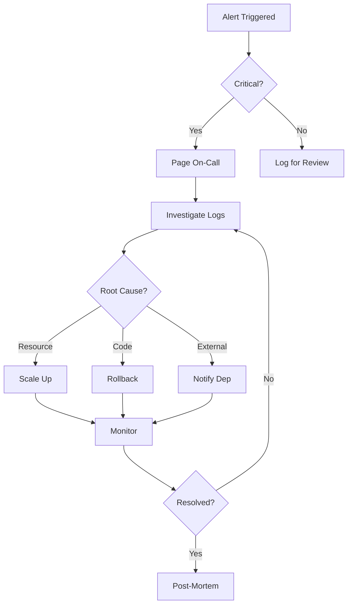

# Deployment Monitoring & Conflict Resolution

## Overview

This document provides procedures for monitoring deployment health and resolving conflicts across the Data-Scientist-MSL organization.

## Monitoring Strategy

### 1. Port Conflict Monitoring

**Automated Detection**:
- CI/CD pipeline runs port conflict checks on every PR and push
- Pre-deployment hooks validate port assignments
- Runtime monitoring detects binding failures

**Tools**:
```bash
# Run port conflict detection
npm run check:ports

# Check specific environment
npm run check:ports:dev
npm run check:ports:staging
npm run check:ports:prod

# CI mode (fails on conflicts)
npm run check:ports:ci

# View port allocation table
npm run show:port-registry
```

### 2. Service Health Monitoring

**Key Metrics**:

| Metric | Target | Alert Threshold | Action |
|--------|--------|----------------|--------|
| Service Availability | 99.9% | < 99.5% | Page on-call |
| Response Time (p95) | < 500ms | > 1000ms | Investigate |
| Error Rate | < 1% | > 2% | Alert team |
| CPU Usage | < 80% | > 90% | Scale up |
| Memory Usage | < 85% | > 95% | Investigate leak |

**Implementation**:
```yaml
# Example health check endpoint
GET /health
Response: {
  "status": "healthy",
  "uptime": 86400,
  "version": "1.0.0",
  "checks": {
    "database": "healthy",
    "cache": "healthy"
  }
}
```

### 3. Deployment Tracking

**What to Track**:
- Deployment timestamp
- Version deployed
- Environment (dev/staging/prod)
- Deployer
- Port assignments
- Success/failure status
- Rollback events

**Log Format**:
```json
{
  "timestamp": "2026-01-26T02:16:17.451Z",
  "service": "reposense",
  "version": "1.0.0",
  "environment": "production",
  "ports": [3200],
  "deployer": "github-actions",
  "status": "success",
  "duration_seconds": 45
}
```

## Conflict Resolution Procedures

### Port Conflict Resolution

**Detection**:
1. CI pipeline fails with port conflict error
2. Manual detection via `npm run check:ports`
3. Runtime binding failure in logs
4. Alert from monitoring system

**Resolution Steps**:

#### Immediate Actions (< 5 minutes)
1. **Identify** conflicting services and environments
2. **Assess** impact - which service is critical?
3. **Stop** lower-priority service if needed
4. **Document** incident in tracking system

#### Short-term Fix (< 30 minutes)
1. **Reassign** ports to resolve conflict:
   ```bash
   # Update deployment manifest
   vim docker-compose.yml
   # Change port mapping
   ports:
     - "3050:3000"  # Changed from 3000:3000
   
   # Validate no conflicts
   npm run check:ports:ci
   
   # Redeploy
   docker-compose up -d
   ```

2. **Update** port registry:
   ```json
   // port-registry.json
   {
     "service-name": {
       "dev": {
         "start": 3050,
         "end": 3050,
         "description": "Reassigned due to conflict"
       }
     }
   }
   ```

3. **Verify** services are healthy
4. **Commit** changes to version control

#### Long-term Prevention (< 1 week)
1. **Review** port allocation strategy
2. **Update** governance documentation
3. **Add** CI check if missing
4. **Communicate** changes to team
5. **Post-mortem** analysis

### Service Degradation

**Symptoms**:
- High response times
- Increased error rates
- Memory/CPU saturation
- Database connection issues

**Resolution Workflow**:



**Actions by Severity**:

**Critical (P1)**:
- Response Time: < 15 minutes
- Actions: Immediate rollback or scale
- Notification: Page on-call + management
- Post-mortem: Required within 24 hours

**High (P2)**:
- Response Time: < 1 hour
- Actions: Investigate and fix
- Notification: Team channel
- Post-mortem: Recommended

**Medium (P3)**:
- Response Time: < 4 hours
- Actions: Schedule fix
- Notification: Log ticket
- Post-mortem: Optional

### Deployment Rollback

**When to Rollback**:
- Service fails health checks
- Error rate > 5%
- Critical functionality broken
- Security vulnerability detected
- Data corruption risk

**Rollback Procedure**:

```bash
# Docker Compose
docker-compose down
git checkout <previous-commit>
docker-compose up -d

# Kubernetes
kubectl rollout undo deployment/<service-name>
kubectl rollout status deployment/<service-name>

# Verify rollback
curl http://service/health
npm run check:ports
```

**Post-Rollback**:
1. Verify service health
2. Notify stakeholders
3. Investigate root cause
4. Document incident
5. Create fix branch
6. Re-test before re-deploy

## Escalation Matrix

| Level | Response Time | Who to Contact | Channel |
|-------|--------------|----------------|---------|
| L1 - Info | 24 hours | Team lead | Slack |
| L2 - Warning | 4 hours | On-call engineer | Slack + Email |
| L3 - Error | 1 hour | On-call + Team lead | Page + Slack |
| L4 - Critical | 15 minutes | On-call + Management | Page + Phone |

## Incident Response

### 1. Detection
- Automated alerts
- User reports
- Monitoring dashboards
- Manual checks

### 2. Assessment
- Severity level
- Affected services
- Number of users impacted
- Business impact

### 3. Communication
**Internal**:
- Update incident channel
- Notify on-call rotation
- Escalate if needed

**External** (if user-facing):
- Status page update
- Email to affected users
- Social media if critical

### 4. Resolution
- Apply fix
- Verify resolution
- Monitor for regression
- Update stakeholders

### 5. Post-Mortem
**Required for P1/P2**:
- Timeline of events
- Root cause analysis
- Impact assessment
- Action items
- Prevention measures

**Template**:
```markdown
# Incident Post-Mortem: [Title]

## Summary
- **Date**: YYYY-MM-DD
- **Duration**: X hours
- **Severity**: P1/P2/P3
- **Services Affected**: [list]

## Timeline
- HH:MM - Incident detected
- HH:MM - Response started
- HH:MM - Fix applied
- HH:MM - Incident resolved

## Root Cause
[Detailed analysis]

## Impact
- Users affected: X
- Downtime: X minutes
- Financial: $X

## Resolution
[What was done to fix]

## Action Items
- [ ] Fix X by YYYY-MM-DD (@owner)
- [ ] Improve monitoring (@owner)
- [ ] Update docs (@owner)

## Lessons Learned
[What we learned and how to prevent]
```

## Automation & Tools

### CI/CD Integration

**.github/workflows/ci.yml**:
```yaml
- name: Port conflict detection
  run: npm run check:ports:ci

- name: Service health check
  run: |
    docker-compose up -d
    sleep 10
    curl -f http://localhost:3000/health || exit 1
```

### Monitoring Scripts

**monitor-deployments.sh**:
```bash
#!/bin/bash
# Monitor all services and report status

for service in reposense observe muammar; do
  health=$(curl -s http://${service}:3000/health | jq -r .status)
  echo "${service}: ${health}"
  
  if [ "$health" != "healthy" ]; then
    # Alert
    echo "ALERT: ${service} is unhealthy!" | mail -s "Service Alert" ops@example.com
  fi
done
```

### Port Conflict Prevention

**pre-commit hook** (.git/hooks/pre-commit):
```bash
#!/bin/bash
# Run port conflict detection before commit

if git diff --cached --name-only | grep -E '(docker-compose|\.ya?ml)'; then
  echo "Checking for port conflicts..."
  npm run check:ports:ci || exit 1
fi
```

## Best Practices

### Prevention
1. **Always** run port conflict detection before deployment
2. **Document** all port assignments in registry
3. **Use** CI checks to enforce policies
4. **Monitor** service health continuously
5. **Test** in dev/staging before production

### Detection
1. **Automate** as much monitoring as possible
2. **Set up** alerts for key metrics
3. **Review** logs regularly
4. **Track** deployment history
5. **Maintain** up-to-date documentation

### Resolution
1. **Act quickly** on critical issues
2. **Communicate** clearly and often
3. **Document** all incidents
4. **Learn** from every issue
5. **Prevent** recurrence through automation

### Recovery
1. **Have** rollback procedures ready
2. **Test** rollbacks regularly
3. **Maintain** backup deployments
4. **Keep** disaster recovery plan updated
5. **Practice** incident response

## Contact Information

**For Immediate Help**:
- On-call rotation: See PagerDuty schedule
- Slack: #deployment-alerts
- Email: ops@example.com

**For Questions**:
- Deployment team: #deployment-help
- Security team: #security
- DevOps lead: @devops-lead

## References

- [Deployment Governance](./DEPLOYMENT_GOVERNANCE.md)
- [Port Registry](../port-registry.json)
- [CI/CD Pipeline](../.github/workflows/ci.yml)
- [Deployment Templates](../deployment-templates/)

---

**Last Updated**: 2026-01-26  
**Owner**: DevOps Team  
**Review Cycle**: Quarterly
